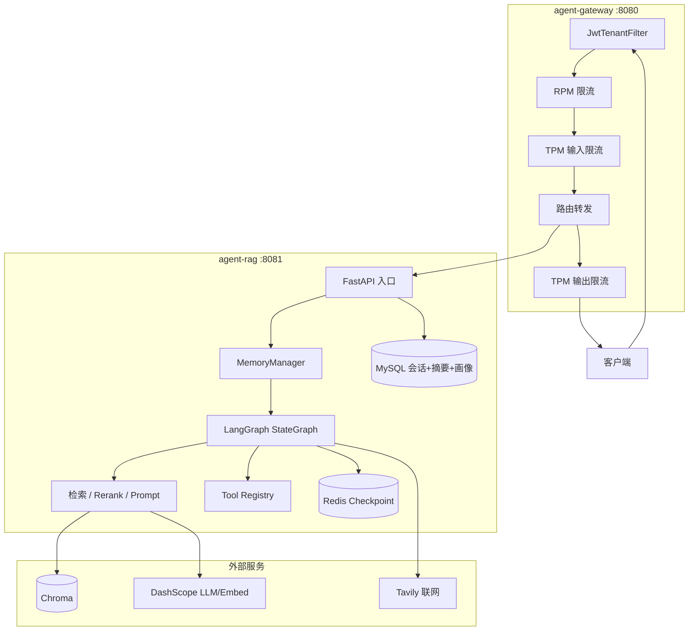
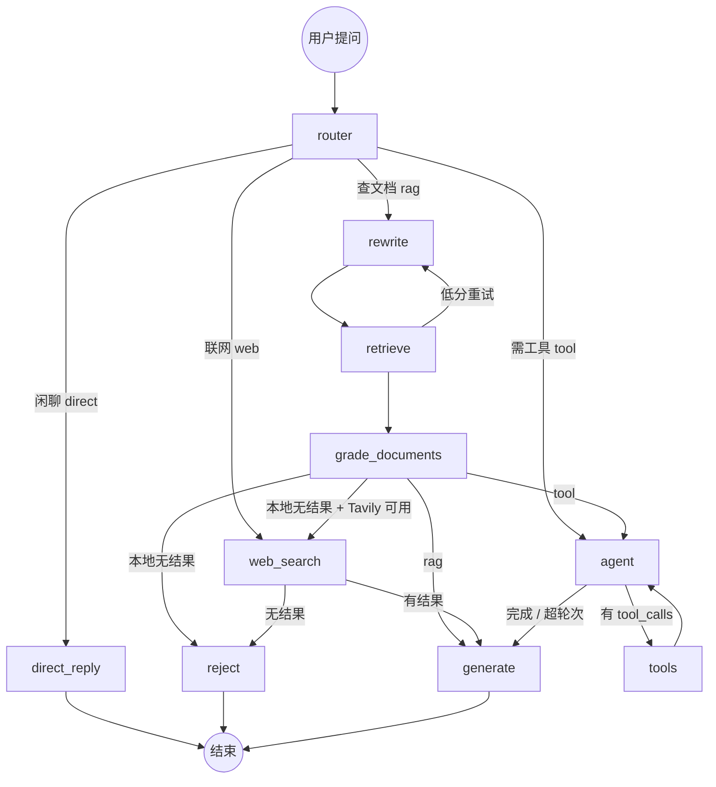
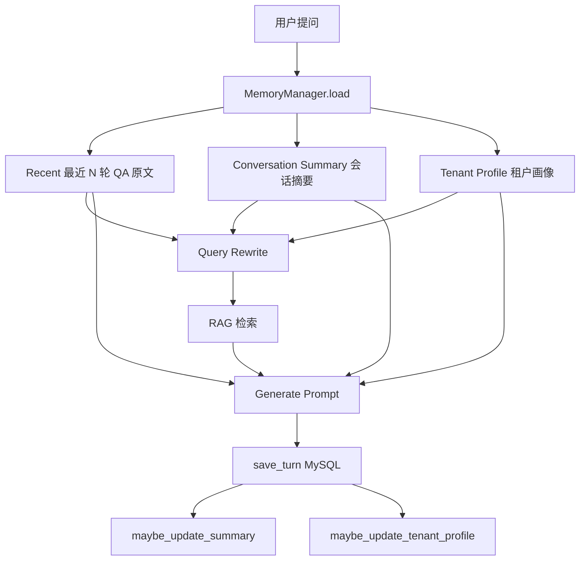
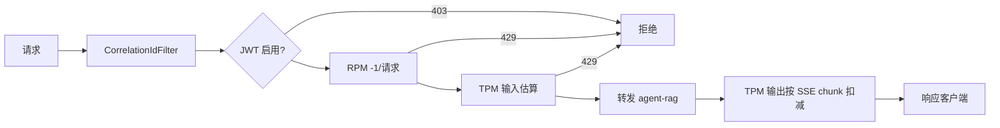

# Agent 后端项目总结

> 聚焦 **agent-rag**（RAG Agent 后端）与 **agent-gateway**（API 网关）两个核心模块。  
> 前端 agent-web 仅作请求入口说明，详细全栈架构见 [architecture.md](./architecture.md)。  
> 简历/面试 7 条能力与本项目的逐项对照见 [PROJECT_CAPABILITY.md](./PROJECT_CAPABILITY.md)。

---

## 一、项目定位

本项目是一套面向**汽车安全白皮书 / 半导体行业文档**的智能问答系统，从 Demo 级固定 RAG 流水线演进为可编排的 **LangGraph Agent 平台**，并通过独立网关实现**多租户 API 治理**。


| 模块                | 端口   | 一句话定位                                                 |
| ----------------- | ---- | ----------------------------------------------------- |
| **agent-gateway** | 8080 | 统一入口：路由、JWT、多租户 RPM/TPM 限流、链路追踪                       |
| **agent-rag**     | 8081 | 智能核心：LangGraph 编排、多轮 Memory、RAG 检索、Tool Calling、会话持久化 |


典型请求链路：

```
客户端 → agent-gateway（限流/鉴权）→ agent-rag（Agent 编排）→ Chroma / DashScope / MySQL / Redis
```

---

## 二、技术栈

### 2.1 agent-rag（Python 后端）


| 类别            | 技术                                            | 用途                                        |
| ------------- | --------------------------------------------- | ----------------------------------------- |
| **Web 框架**    | FastAPI + Uvicorn                             | REST API、SSE 流式对话                         |
| **Agent 编排**  | LangGraph + LangChain                         | StateGraph 状态图、Tool Calling、条件分支          |
| **大模型**       | 阿里云 DashScope（通义 qwen3.7-plus）                | 路由、改写、生成、Agent 决策                         |
| **向量检索**      | Chroma（HTTP Client）+ DashScope Embedding      | 多知识库向量召回                                  |
| **重排序**       | BAAI/bge-reranker-base（sentence-transformers） | 本地 CrossEncoder 精排，控制幻觉                   |
| **会话存储**      | MySQL + SQLAlchemy                            | 对话历史、会话摘要、租户画像、用户反馈                       |
| **多轮 Memory** | `rag/memory/`（MemoryManager）                  | Recent 窗口 + 会话摘要 + 租户画像，Query Rewrite 上下文 |
| **状态缓存**      | Redis + RediSearch                            | LangGraph Checkpoint（当轮 agent 循环）、运维指标计数  |
| **文档入库**      | 阿里云 DocMind + 自研切片脚本                          | PDF 解析 → 切块 → Embedding → Chroma          |
| **联网兜底**      | Tavily                                        | 本地检索失败时自动联网搜索                             |
| **工具扩展**      | MCP Server（可选）                                | 白皮书检索、Tavily 检索的标准化接入                     |
| **可观测**       | OpenTelemetry + Prometheus + Tempo            | Trace、Metrics、Admin 看板                    |


### 2.2 agent-gateway（Java 网关）


| 类别      | 技术                                      | 用途                         |
| ------- | --------------------------------------- | -------------------------- |
| **框架**  | Spring Boot 4 + Java 21                 | 应用运行时                      |
| **网关**  | Spring Cloud Gateway（WebFlux 响应式）       | 反向代理、路由转发                  |
| **限流**  | Bucket4j + Lettuce Redis                | 分布式令牌桶，多实例一致               |
| **鉴权**  | JWT（可选）                                 | `sub` 与 `X-Tenant-Id` 绑定校验 |
| **可观测** | Micrometer + OpenTelemetry + Prometheus | 限流 Span、指标暴露               |


### 2.3 共享基础设施


| 依赖                | 作用                                        |
| ----------------- | ----------------------------------------- |
| **Redis**         | 网关限流计数 + RAG Checkpoint/指标（共用实例，key 前缀隔离） |
| **Chroma**        | 向量数据库，按 Collection 区分知识库                  |
| **MySQL**         | 会话、摘要、租户画像、反馈持久化                          |
| **DashScope API** | LLM 与 Embedding 统一调用                      |


---

## 三、项目架构

### 3.1 分层职责




**职责边界：**

- **Gateway 管「能不能调、调多少」**：租户识别、RPM/TPM 配额、路由、Trace 注入；不承载业务智能。
- **RAG 管「怎么答、答什么」**：Memory 加载、意图路由、Query Rewrite、检索增强、工具调用、流式生成、引用标注、会话持久化。

### 3.2 agent-rag 核心模块


| 路径                      | 职责                                          |
| ----------------------- | ------------------------------------------- |
| `api/`                  | HTTP 路由：聊天 SSE、会话 CRUD、反馈、Admin 指标与租户画像     |
| `rag/memory/`           | 多轮 Memory：Recent 窗口、会话摘要压缩、租户画像提取           |
| `rag/graph/`            | LangGraph 状态图：节点定义、条件边、流式事件映射               |
| `rag/assistant.py`      | Chroma 检索、Embedding、Rerank、Prompt 模板        |
| `rag/router.py`         | LLM 四分类路由：`direct` / `rag` / `tool` / `web` |
| `rag/tools/`            | 本地 Tool + MCP Client + Tavily 联网            |
| `rag/checkpoint.py`     | Redis Checkpoint（失败降级 MemorySaver）          |
| `rag/request_budget.py` | 单请求 Token/工具轮次/超时预算，超限强制 generate           |
| `db/`                   | MySQL 会话、摘要、租户画像、反馈模型                       |
| `doc_parse/`            | 离线文档入库流水线                                   |
| `eval/`                 | RAG 质量评测（Golden 集 + LLM Judge + API 模式）     |
| `mcp_servers/`          | 可选 MCP Server（whitepaper / tavily）          |


### 3.3 LangGraph 编排流程




三条路径对比：


| 路由       | 场景          | 典型路径                                  |
| -------- | ----------- | ------------------------------------- |
| `direct` | 问候、闲聊       | router → direct_reply                 |
| `rag`    | 查白皮书/半导体文档  | rewrite → retrieve → grade → generate |
| `web`    | 实时/公开信息     | router → web_search → generate/reject |
| `tool`   | 精确查页、统计、查配额 | agent ↔ tools（最多 3 轮）→ generate       |


### 3.4 多轮 Memory 架构

跨轮上下文由 **MySQL + MemoryManager** 统一管理，LangGraph Checkpoint 仅保存当轮 agent↔tools 循环状态，避免跨轮 `messages` 重复累加。




**三段式 Memory（详见 [MemoryChat.md](./MemoryChat.md)）：**


| 层级                       | 存储                                      | 用途                           |
| ------------------------ | --------------------------------------- | ---------------------------- |
| **Recent Messages**      | `chat_messages` 最近 `CHAT_WINDOW_SIZE` 轮 | 短期连续性，完整 user+assistant QA 对 |
| **Conversation Summary** | `conversations.summary`                 | 窗口外历史压缩，超长会话触发 LLM 更新        |
| **Tenant Profile**       | `tenant_profiles`                       | 租户级业务背景（领域、常用系统、回答风格），非 PII  |


Prompt 组装顺序：`【租户背景】→【会话摘要】→【最近对话】→ DOCUMENT → 当前问题`。历史**不直接用于向量检索**，先经 Query Rewrite 补全指代后再检索。

关键环境变量：`CHAT_WINDOW_SIZE`（默认 5）、`CHAT_SUMMARY_TRIGGER_ROUNDS`（默认 10）、`TENANT_PROFILE_UPDATE_INTERVAL`（默认 20）。

### 3.5 agent-gateway 限流链路




限流维度（按 `X-Tenant-Id` 分桶）：


| 维度         | 说明               | 默认配额（default_tenant） |
| ---------- | ---------------- | -------------------- |
| **RPM**    | 每分钟请求数           | 60                   |
| **TPM 输入** | 请求 body 估算 Token | 2000/分钟              |
| **TPM 输出** | 流式响应累计 Token     | 2000/分钟              |


`/admin/`**、`/health` 跳过限流；未传租户头时使用 `default_tenant`。

Gateway 路由：


| 路径                       | 上游                    | 说明        |
| ------------------------ | --------------------- | --------- |
| `/api/`**                | agent-rag:8081        | 主业务 API   |
| `/health`                | agent-rag:8081        | 健康检查      |
| `/admin/rag/`**          | Rewrite → `/admin/**` | RAG 运维指标  |
| `/admin/gateway/metrics` | 网关自身                  | 租户配额与限流统计 |


### 3.6 内置 Tools（5 个）

1. `search_whitepaper` — 向量检索 + Rerank
2. `get_chunk_by_source` — 按文件名 + 页码精确查 chunk
3. `list_collection_stats` — 知识库集合统计
4. `get_tenant_quota` — 跨服务读取 Gateway 租户配额
5. `reject_or_clarify` — 检索质量不足时的业务拒答

---

## 四、难点与亮点

### 4.1 从固定 RAG 到 LangGraph Agent 的平滑演进

**难点：** 原有 `rewrite → retrieve → generate` 流水线无法分支决策、无法 Tool Calling，每问必检索浪费 TPM。

**亮点：**

- 用 **StateGraph** 显式建模状态与条件边，节点 1:1 迁移，风险可控
- **Router 四分类**：闲聊不走 RAG；实时/公开信息走 `web`；复杂问题走 Agent + Tool 循环
- 保留原有 SSE 契约（`status` / `token` / `done`），扩展 `tool_call` 事件，前端渐进升级

### 4.2 检索质量门控，降低幻觉

**难点：** 向量检索可能返回不相关文档，直接生成会产生幻觉。

**亮点：**

- 本地 **BGE Reranker** 对 Top-N 精排至 Top-K，延迟可控、无额外 API 成本
- `grade_documents` + `should_reject()` 基于分数阈值（默认 0.15）拒答或澄清
- 检索失败可触发 **rewrite 重试**（最多 2 次）；本地仍无结果时 **Tavily 联网兜底**
- Prompt 强制要求 `[来源：文件名 第N页]` 标注，SSE `done` 返回 citations

### 4.3 SSE 流式与 LangGraph 双模式契合

**难点：** Agent 多节点执行时，既要展示「正在检索/调工具」进度，又要 LLM token 级流式输出。

**亮点：**

- `stream_mode=["updates", "messages"]` 双模式并行
- `updates` → SSE `status` / `tool_call`（Agent 轨迹可见）
- `messages` 按 `langgraph_node` 白名单过滤，仅 `generate` / `direct_reply` 映射为 `token`
- 内部节点（rewrite、agent 决策）不泄漏到前端，协议稳定

### 4.4 Gateway 流式场景下的分布式 TPM 限流

**难点：** 多实例网关 + SSE 流式响应，如何在输入/输出两侧准确扣减 Token 配额。

**亮点：**

- **Bucket4j + Redis CAS** 实现分布式令牌桶，多实例一致
- **TPM 输入**：缓存 body → JSON 解析估算 Token → 扣配额 → Decorator 回放 body 转发
- **TPM 输出**：装饰 `ServerHttpResponse.writeWith`，按 SSE chunk 实时扣减
- 429 返回 OpenAI 风格 JSON（含 `request_id`），前端友好展示
- 与 RAG 内 `MAX_TOOL_ROUNDS=3` 对齐，防止 Agent 循环导致 TPM 爆炸

### 4.5 多租户 / 多知识库隔离

**亮点：**

- `X-Tenant-Id` 贯穿 Gateway 限流、RAG metrics、MySQL、Checkpoint
- Assistant 按 `(tenant, collection)` 缓存，支持 `white_paper_iot`、`semiconductor` 等多知识库
- 可选 JWT：`sub` 必须与 `X-Tenant-Id` 一致，防止租户冒用
- Tool `get_tenant_quota` 让 Agent 能回答「我还剩多少配额」

### 4.6 可观测性三层架构

**亮点：**


| 层           | 实现                           | 价值                                         |
| ----------- | ---------------------------- | ------------------------------------------ |
| **Trace**   | OTel → Tempo                 | 单次请求节点级耗时（router/retrieve/rerank/generate） |
| **Metrics** | Prometheus histogram/counter | p95 延迟、拒答率、检索分数分布                          |
| **业务计数**    | Redis incr                   | Admin 看板跨重启累计（LLM/Embed/Rerank/Tavily 调用量） |


Gateway 与 RAG 均暴露 Prometheus 端点，Docker Compose 一键部署 Grafana 仪表盘。

### 4.7 会话持久化与多轮 Memory

**难点：** 简单滑动窗口无法覆盖超长会话；图路径若只注入 user 消息会丢失 assistant 上下文；Checkpoint `add_messages` 跨轮累加导致脏 state。

**亮点：**

- **MySQL 为跨轮唯一来源**：每轮由 `MemoryManager` 加载 Recent + Summary + Tenant Profile，注入 `AgentState`；`messages=[]` 每轮重置，仅用于当轮 tool 循环
- **会话摘要压缩**：超过轮数/token 阈值后 LLM 更新 `conversations.summary`，窗口外历史不丢失
- **租户画像**：自动从会话提取业务背景（`source=auto`），Admin `GET/PUT /admin/tenant-profile` 支持 manual 覆盖
- LangGraph **Redis Checkpoint** 保存当轮图中间 state；Redis 不可用 → **MemorySaver** 降级
- MySQL 写入 **best-effort**：摘要/画像更新失败不阻断 SSE；`done.metadata.memory` 记录窗口与摘要状态
- 支持 `POST /api/chat/stop` 中断当前 thread 推理

### 4.8 MCP 工具标准化（可选）

**亮点：**

- 核心检索能力可抽成独立 MCP Server（`mcp_servers/whitepaper`、`mcp_servers/tavily`）
- agent-rag 通过 MCP Client 注册为 LangChain Tool，工具契约清晰、可独立测试
- 同一 MCP Server 可被 IDE 与线上服务复用，扩展新数据源无需改 RAG 主链路

---

## 五、达到的效果与解决的问题

### 5.1 解决了什么问题


| 问题                      | 解决方案                            | 效果                     |
| ----------------------- | ------------------------------- | ---------------------- |
| 固定 RAG 每问必检索，闲聊也消耗 TPM  | Router 四分类 + direct 路径          | 闲聊零检索，TPM 成本显著下降       |
| 多轮指代导致检索 query 无效       | Memory + Query Rewrite 后再检索     | 「这个方案」类追问可正确召回         |
| 超长对话超出窗口后上下文丢失          | 会话摘要 + Recent 窗口组合              | 远程历史压缩保留，近期原文保连续       |
| 向量检索噪声大，容易幻觉            | BGE Rerank + 分数阈值拒答 + 强制引用标注    | 回答有据可查，低质量检索主动拒答       |
| 复杂问题无法多步推理（对比章节、精确查页）   | Agent + Tool Calling 循环         | 模型可主动选工具，多轮检索/统计       |
| 本地知识库覆盖不足               | Tavily 联网兜底                     | 本地无结果时自动联网，并明确标注来源类型   |
| 多租户 SaaS 场景无 API 治理     | Gateway RPM/TPM 三层限流            | 按租户隔离配额，429 友好提示       |
| Agent 多轮 LLM 调用 TPM 不可控 | 图内轮次上限 + Gateway 双向 TPM         | 成本可预测，Demo 不易触发 429    |
| 对话状态只在内存，重启丢失           | MySQL（历史+摘要+画像）+ Checkpoint     | 多轮上下文可恢复，超长会话可压缩       |
| 黑盒流水线，用户不知系统在做什么        | SSE status/tool_call 事件         | 前端可展示 Agent 轨迹（检索、调工具） |
| 运维不可见                   | Prometheus + Grafana + Admin 看板 | 延迟、拒答率、各租户调用量一目了然      |


### 5.2 达成的核心能力

1. **智能问答**：汽车安全白皮书 / 半导体文档的专业 RAG 问答，带页码级引用
2. **Agent 编排**：LangGraph 驱动的四路径决策（闲聊 / RAG / Web / Tool），可解释、可扩展
3. **多轮 Memory**：Recent 窗口 + 会话摘要 + 租户画像，Rewrite 与 Generate 分阶段注入
4. **多租户治理**：Gateway 按租户 RPM/TPM 限流，VIP 与普通租户差异化配额
5. **流式体验**：SSE token 级流式输出 + Agent 进度实时推送
6. **质量保障**：Rerank 精排、拒答机制、引用标注、citations 返回
7. **全链路可观测**：Trace + Metrics + Admin 双服务看板
8. **文档入库**：DocMind 解析 → 切片 → Embedding → Chroma 完整离线流水线
9. **可扩展工具**：MCP 标准化接入，Tavily 联网兜底
10. **RAG 质量评测**：Golden 集 + LLM Judge，`scripts/run_quality_eval.py` API/本地双模式

### 5.3 适用场景

- **企业内部知识库问答**：白皮书、技术文档、行业报告
- **多租户 AI API 平台 Demo**：展示限流、配额、租户隔离
- **RAG → Agent 演进参考**：从固定流水线到 LangGraph 的渐进式改造范例
- ** 技术分享**：涵盖 RAG、Agent、Gateway 限流、可观测等完整后端栈

---

## 六、演进阶段一览


| 阶段       | 内容                                           | 状态          |
| -------- | -------------------------------------------- | ----------- |
| Phase 1  | Tool Calling + SSE 扩展                        | ✅ 已完成       |
| Phase 2  | LangGraph 替换固定流水线 + Router                   | ✅ 已完成       |
| Phase 3  | MySQL 会话持久化 + 反馈                             | ✅ 已完成       |
| Phase 4  | MCP 可选接入                                     | ✅ 已实现       |
| Phase 4b | Tavily 联网检索兜底                                | ✅ 已实现       |
| Phase 4c | 多轮 Memory（Recent + Summary + Tenant Profile） | ✅ 已实现       |
| Phase 5  | HTTP ingest 打通 DocMind 流水线                   | ⚠️ 占位，待完善   |
| Phase 6  | 幻觉检测节点                                       | ⚠️ 部分（拒答已有） |


---

## 七、本地启动

```bash
# 1. 基础设施
Redis     → 127.0.0.1:6379
Chroma    → 127.0.0.1:8000
MySQL     → 见 .env.example

# 2. agent-rag
cd agent-rag && python api_server.py    # → 8081

# 已有 MySQL 库升级 Memory 表结构（新环境 init_db 可跳过）
mysql -u root -p appdb < db/migrations/001_memory_upgrade.sql

# 3. agent-gateway
cd agent-gateway && ./mvnw spring-boot:run   # → 8080

# agent-web
cd agent-gateway &&  agent-web
npm run dev

# 4. 验证
curl http://localhost:8080/health -H "X-Tenant-Id: default_tenant"

# CLI RAG评测（需 RAG API + Chroma 就绪）
python scripts/run_quality_eval.py --mode api
# 集成测试
set EVAL_INTEGRATION=1
pytest tests/test_quality_check.py -s -v
```

可选观测栈：`deploy/observability/docker-compose.yaml` → Grafana [http://localhost:3000](http://localhost:3000)

---


