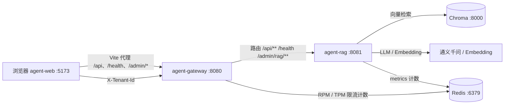

# Agent 工作空间总览

> 完整架构图、数据流、技术栈与面试要点见 **[architecture.md](./architecture.md)**。

本 Cursor 工作空间由三个独立 Git 仓库组成，共同实现「汽车安全白皮书」RAG 问答与多租户 API 网关限流演示。

| 仓库 | 路径 | 技术栈 | 默认端口 |
|------|------|--------|----------|
| **agent-web** | `../agent-web`（`Project/Python/agent-web`） | React 19 + TypeScript + Vite + Tailwind | **5173** |
| **agent-gateway** | `../../Java/agent-gateway` | Spring Boot 4 + Spring Cloud Gateway + Bucket4j + Redis | **8080** |
| **agent-rag** | 本仓库 | Python FastAPI + LangChain + Chroma + 通义千问 | **8081** |

外部依赖：**Redis**（6379）、**Chroma**（8000）、**DashScope API Key**（通义 Embedding / LLM）。

---

## 架构与请求链路



典型聊天流程：

1. 用户在 **agent-web** 选择租户（`X-Tenant-Id`），发送消息。
2. 开发环境下 Vite 将 `/api/chat/stream` 等请求代理到 **agent-gateway**（8080）。
3. 网关按租户执行 **RPM**（每分钟请求数）与 **TPM 输入/输出**（每分钟 Token）限流；`/health` 与 `/admin/**` 跳过限流。
4. 通过后转发至 **agent-rag**（8081）的 `POST /api/chat/stream`，返回 SSE 流（`status` → `token` → `done`）。
5. RAG 服务完成：问题改写 → Chroma 向量召回 → 本地 BGE Rerank → 通义千问流式生成，并在回答中标注 `[来源：文件名 第N页]`。

---

## 1. agent-rag（RAG 后端）

**职责**：文档向量化入库、检索增强生成（RAG）、流式对话 API、RAG 侧运维指标。

### 核心能力

- **领域**：汽车安全白皮书问答助手（`CarSafetyWhitepaperAssistant`）。
- **检索**：DashScope Embedding → Chroma 召回 Top-N → 可选本地 `BAAI/bge-reranker-base` 重排至 Top-K。
- **生成**：通义千问（默认 `qwen-plus`），支持多轮对话窗口（`CHAT_WINDOW_SIZE`）。
- **流式 API**：`POST /api/chat/stream`，SSE 事件类型：`status` / `token` / `done` / `error`。
- **指标**：LLM / Embedding / Rerank 调用次数写入 Redis（与网关共用实例），`GET /admin/metrics` 暴露集合规模、模型配置、CPU/GPU/内存快照。

### 主要目录

| 路径 | 说明 |
|------|------|
| `api/` | FastAPI 路由：`chat.py`、`admin.py`、`schemas.py` |
| `rag/` | `assistant.py`（RAG 主逻辑）、`rerank_local.py`、`metrics.py` |
| `doc_parse/` | 阿里云 DocMind 解析、JSON 切块、`ingest_chroma.py` 写入 Chroma |
| `doc_result/` | 解析后的结构化 JSON |
| `api_server.py` | 启动入口（加载 `.env`、uvicorn） |

### HTTP 接口（直连 8081；生产经网关访问）

| 方法 | 路径 | 说明 |
|------|------|------|
| GET | `/health` | 健康检查，返回 Chroma 集合名 |
| POST | `/api/chat/stream` | 流式对话（JSON body：`message`、`history`） |
| GET | `/admin/metrics` | RAG 运维指标（网关对外路径为 `/admin/rag/metrics`） |

### 配置

复制 `.env.example` 为 `.env`，重点配置 `DASHSCOPE_API_KEY`、`CHROMA_*`、`REDIS_*`、`API_PORT=8081`。

### 本地启动（示例）

```bash
# 需先启动 Chroma Server（默认 8000）与 Redis
cd agent-rag
python -m venv .venv
.venv\Scripts\activate
pip install -r requirements.txt
python api_server.py
```

文档入库（可选）：`doc_parse/run_docmind_pipeline.py` → `doc_parse/ingest_chroma.py`。

---

## 2. agent-gateway（API 网关）

**职责**：统一入口、反向代理到 RAG、多租户分布式限流、网关侧限流指标。

### 核心能力

- **框架**：Spring Cloud Gateway（WebFlux），Java 21。
- **路由**（`application.yaml`）：
  - `/api/**`、`/health` → `http://127.0.0.1:8081`
  - `/admin/rag/**` → 重写为 `/admin/**` 后转发 RAG
  - `/v1/**`、`/httpbin/**` → 演示用上游（可替换为真实 LLM）
- **限流**（Redis + Bucket4j，按 `X-Tenant-Id` 分桶）：
  1. **RPM**：每请求消耗 1 配额（`MultiTenantRateLimitFilter`）
  2. **TPM 输入**：匹配 `app.rate-limit.llm-path-prefixes`（含 `/api/chat/`）的 POST，按 body 估算 Token（`TenantTpmInputRateLimitFilter`）
  3. **TPM 输出**：对流式响应累计输出 Token（`TenantTpmOutputRateLimitFilter`）
- **豁免**：`/admin/**` 全部跳过限流；`/health` 跳过 RPM（便于前端探活）。
- **指标**：网关自身提供 `GET /admin/gateway/metrics`（各租户 RPM/TPM 限额、剩余配额、通过/拒绝计数）。

### 演示租户配额（`TenantQuotaService`）

| 租户 ID | RPM/min | TPM 输入/输出/min |
|---------|---------|-------------------|
| `default_tenant` | 60 | 2000 |
| `default_tenant_test` | 2 | 2000 |
| `tenant_vip` | 10 | 10000 |
| `tenant_vip_test` | 2 | 10000 |

未传 `X-Tenant-Id` 时使用 `default_tenant`。

### 本地启动（示例）

```bash
cd agent-gateway
# 需 Redis 运行在 localhost:6379
./mvnw spring-boot:run
```

联调脚本：`scripts/test-rate-limit.ps1`。集成测试：`mvn test`（`RateLimitIntegrationTest`）。

---

## 3. agent-web（前端）

**职责**：聊天 UI、租户切换、SSE 流式展示、双服务管理看板。

### 核心能力

- **页面**：
  - `/`：汽车安全白皮书助手（`ChatPage` / `ChatLayout`）
  - `/admin`：RAG + Gateway 指标看板（`AdminPage`）
- **租户**：下拉选择四种演示租户，请求头携带 `X-Tenant-Id`；429 时展示友好限流提示。
- **开发代理**（`vite.config.ts`）：将 `/api`、`/health`、`/admin/gateway`、`/admin/rag` 代理到 `http://127.0.0.1:8080`（网关），无需配置 `VITE_API_BASE_URL`。

### 主要目录

| 路径 | 说明 |
|------|------|
| `src/api/chatStream.ts` | SSE 解析、`/api/chat/stream`、`/health` |
| `src/api/adminMetrics.ts` | `/admin/rag/metrics`、`/admin/gateway/metrics` |
| `src/hooks/` | `useChatStream`、`useAdminMetrics` |
| `src/components/` | 消息列表、输入框、布局 |
| `src/pages/` | `ChatPage`、`AdminPage` |

### 本地启动（示例）

```bash
cd agent-web
npm install
npm run dev
# 浏览器 http://localhost:5173
```

---

## 推荐启动顺序

1. **Redis** `127.0.0.1:6379`
2. **Chroma** `127.0.0.1:8000`（RAG 向量库）
3. **agent-rag** → `8081`
4. **agent-gateway** → `8080`
5. **agent-web** → `5173`

验证：

- 聊天页健康状态为「后端在线」
- `GET http://localhost:8080/health`（可带 `X-Tenant-Id`）
- 管理看板 `/admin` 同时加载 RAG 与 Gateway 指标

### 本地观测（Prometheus / Grafana）

需要时序曲线与 p95 延迟时，启动 Docker 观测栈（详见 `deploy/observability/README.md`）：

```bash
cd agent-rag/deploy/observability && docker compose up -d
```

- Grafana 仪表盘：http://localhost:3000/d/agent-observability
- RAG 原始指标：`http://127.0.0.1:8081/metrics`（顶部 `# scrape_time_utc` 注释与 `X-Metrics-Scrape-At` 响应头为人读时间）
- 管理看板 `/admin` 提供 Grafana/Prometheus 快捷链接

---

## 共享与约定

| 项 | 约定 |
|----|------|
| 租户头 | `X-Tenant-Id`（网关解析，RAG 当前不校验，仅网关限流使用） |
| Redis DB | 默认 `database: 0`，RAG metrics key 前缀 `metrics:rag:*`，网关 Bucket4j key 前缀 `limit:*` |
| 限流响应 | HTTP 429，JSON 形如 OpenAI `rate_limit_exceeded`（前端已解析） |
| CORS | RAG 默认允许 `http://localhost:5173`；经网关访问时由网关转发，浏览器只连 5173→8080 |

---

## 仓库关系说明

三个目录为**并列独立仓库**，无 monorepo 根目录。本文档位于 **agent-rag** 的 `docs/WORKSPACE.md`，便于在本工作空间打开时查阅全貌；修改某一服务时请进入对应仓库提交。

---

## 技术栈速查

| 层级 | 主要依赖 |
|------|----------|
| 前端 | React 19, react-router-dom 7, react-markdown, Tailwind CSS 4, Vite 8 |
| 网关 | Spring Boot 4.0.6, Spring Cloud Gateway 2025.1.1, bucket4j_jdk17-lettuce 8.14 |
| RAG | FastAPI, uvicorn, langchain-community, chromadb, sentence-transformers, redis, psutil |
| 模型 / 云 | 阿里云 DashScope（Qwen + text-embedding-v3）、可选 DocMind 文档解析、HuggingFace 本地 Rerank |
