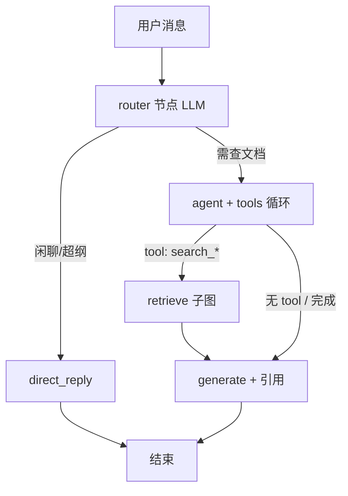
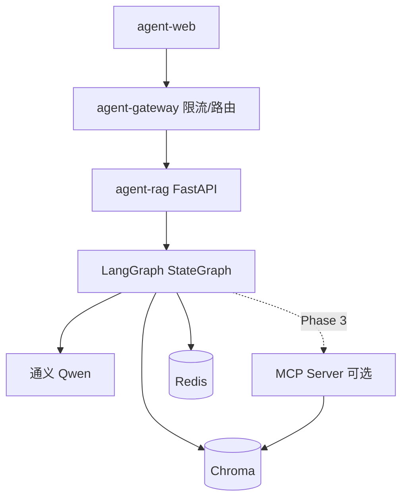

# Demo → 可演进 Agent 平台：技术选型与方案

## 现状判断

当前 **agent-rag** 是**固定流水线 RAG**（改写 → 检索 → Rerank → 生成），不是 Agent：

- 无分支决策（例如：闲聊 vs 查白皮书 vs 需要计算）
- 无 Tool Calling（模型不能主动选工具）
- 状态只在内存/前端 history，无会话持久化与可观测 trace
- **agent-gateway** 的 Agent 能力已较完整（多租户限流 + 指标），可继续作为「边缘策略层」
- **agent-web** 适合展示 Agent 过程（工具调用、节点状态），但协议需扩展

下面按四个技术点说明**是否采用、放在哪、怎么演进**，并给出分阶段路线。**本回复仅方案，不涉及改代码。**

---

## 总体原则（先定边界）

| 原则 | 说明 |
|------|------|
| **网关少动** | 限流、路由、租户头继续在 gateway；业务智能下沉到 agent-rag |
| **LangGraph 管编排，Tool 管能力，MCP 管扩展** | 三者职责不重叠：图决定「走哪条路」，Tool 是图里的节点能力，MCP 是 Tool 的标准化接入方式 |
| **Demo 不要一次全上** | 建议顺序：**Tool Calling（小集）→ LangGraph（替换流水线）→ Agent 路由 → MCP（按需）** |
| **保留现有 SSE 契约** | 前端已认 `status/token/done`；扩展 `tool_call` / `node` 事件，避免推翻 UI |

---

## 1. LangGraph — **推荐采用（核心改造点）**

### 解决什么问题

把 `assistant.py` 里写死的 `rewrite → retrieve → generate` 变成**显式状态图**，便于：

- 条件分支（是否检索、是否多轮改写、检索为空是否拒答）
- 循环（检索质量不够 → 改写 query 再搜，最多 N 次）
- 检查点（会话 state、可中断/恢复，为以后 HITL 留口子）
- 与 LangSmith / 自建 trace 对齐（每个 node 对应现有 `status` stage）

### 推荐方式

在 **agent-rag** 新增 `rag/graph/`，用 **StateGraph** 建模，状态字段示例：

```text
messages, rewritten_query, documents[], context, answer,
route ("rag" | "direct" | "tool"), tool_calls[], citations[]
```

**节点映射（与现逻辑 1:1 迁移，风险低）：**

| 现有步骤 | LangGraph 节点 |
|----------|----------------|
| `rewrite_query` | `rewrite` |
| `get_context` | `retrieve` + `rerank`（可拆两节点便于指标） |
| `chain.stream` | `generate` |
| （新增） | `grade_documents` / `check_hallucination`（可选，第二阶段） |

**流式输出：** 用 `astream_events` 或自定义 callback，把 `on_chain_start` 映射为 SSE `status`，`on_llm_stream` 映射为 `token`——前端几乎不用改。

### 不建议

- 一上来做 10+ 节点的复杂图；Demo 阶段 **5～7 个节点**足够体现价值
- 在 gateway 里跑 LangGraph（Java 侧不合适）

---

## 2. Tool Calling — **推荐采用（与 LangGraph 同阶段引入）**

### 解决什么问题

白皮书场景里，纯 RAG 无法覆盖：

- 「对比第 3 章和第 5 章差异」→ 需要**多次检索**或**按 metadata 过滤**
- 「统计文档里出现几次 XXX」→ 需要**结构化查询**而非一次向量搜
- 「引用是否真实」→ 需要**校验工具**（查 chunk id / 页码）
- 「今天演示租户还剩多少配额」→ 可调 **gateway metrics**（只读）

### 推荐 Tool 清单（第一期 4～5 个，够 Demo 升格）

| Tool | 作用 | 实现要点 |
|------|------|----------|
| `search_whitepaper` | 向量检索 + rerank（封装现有 `get_context`） | 主路径，默认 Agent 仍走 RAG |
| `get_chunk_by_source` | 按 `source + page` 精确拉 chunk | 强化引用、减少幻觉 |
| `list_collection_stats` | 集合文档数、来源列表 | 运维/探索型问题 |
| `get_tenant_quota`（可选） | 读 gateway `/admin/gateway/metrics` | 演示多租户，HTTP 只读 |
| `reject_or_clarify` | 检索分过低时要求用户澄清 | 业务规则工具，非 LLM 瞎编 |

**绑定方式：** Qwen 通过 LangChain `bind_tools` / DashScope function calling；在 LangGraph 里增加 **`agent` 节点**（决定是否调 tool）和 **`tools` 节点**（执行后回到 agent 或 generate）。

### 路由策略（简单且稳）



- **Router** 用短 prompt + 低 temperature，避免每次都走 RAG（省 TPM，网关友好）
- **Tool 循环上限** `max_tool_rounds=3`，防止 TPM 爆炸（与 gateway TPM 限流一致）

### 不建议

- 第一期就上「写库 / 删文档 / 发邮件」等副作用工具（Demo 安全风险大）
- 让模型自由拼 SQL 查 Chroma；用**封装好的 Tool** 代替

---

## 3. Agent — **推荐采用（语义升级，非另起炉灶）**

### 在本项目里的含义

「Agent」不是再写一个聊天机器人，而是：

> **在 LangGraph 上，由 LLM 根据状态决定下一步（调 Tool / 直接答 / 再检索 / 结束）**

与现在的区别：

| 现在 | Agent 化后 |
|------|------------|
| 每问必检索 | 先路由，闲聊不检索 |
| 固定一次改写 | 可多轮 tool + 改写 |
| 黑盒流水线 | SSE 可展示「正在调用 search_whitepaper」 |

### 推荐形态：**单 Agent + 专用子图**（不要多 Agent 辩论）

- **主 Agent**：白皮书助手，system prompt 保持现有「必须依据 DOCUMENT + 来源标注」
- **子图 `rag_subgraph`**：retrieve → rerank → 返回 tool result 给 Agent
- 暂不做「Planner Agent + Worker Agent」双 Agent（Demo 复杂度过高）

### 与 gateway / web 的配合

- 请求头继续传 `X-Tenant-Id`；Agent 内**只读** quota tool 用于回答「我还能问几次吗」
- **agent-web** 后续可增加：
  - 折叠面板：本轮 `tool_calls`、改写后 query、引用 chunk
  - Admin 页增加 LangGraph run_id / 节点耗时（若接 LangSmith）

---

## 4. MCP — **有条件采用**

### 解决什么问题

- **标准化工具接入**：新能力（法规 API、企业内部 Wiki、Jira）以 MCP Server 暴露，agent-rag 不必每次改 Python 发版
- **与 Cursor / 其他客户端复用**：同一 MCP Server 可被 IDE 与线上服务共用（若你关心开发体验）

### 推荐方式（二选一，按目标选）

**方案 A — MCP 作为 Tool 提供方（推荐，与生产路径一致）**

```text
agent-rag (LangGraph)
  └─ tools 节点
       └─ MCP Client ──stdio/SSE──► mcp-whitepaper-server
                                    ├─ search_whitepaper
                                    ├─ get_chunk_by_source
                                    └─ ingest_status (只读)
```

- 把现有 Chroma 检索封装进 **`mcp-whitepaper`**（Python `mcp` SDK 或 FastMCP）
- agent-rag 用 `langchain-mcp-adapters` 或自写薄 Client 注册为 LangChain Tool
- **好处**：工具契约清晰、可独立测试、以后加「车联网法规 MCP」只加 Server

**方案 B — MCP 仅用于开发/运维（轻量）**

- 不改线上链路；用 MCP 暴露 `ingest_chroma`、`metrics` 给 Cursor Agent 本地运维
- **好处**：改动最小；**坏处**：线上 Agent 能力不提升，Demo 故事弱


- 让 **agent-gateway** 实现 MCP（Java MCP 生态不成熟，职责混乱）
- 前端直连 MCP（浏览器安全与鉴权复杂）；**始终经 gateway → rag**

### 建议优先级

| 阶段 | MCP |
|------|-----|
| Phase 1～2 | 不用，Tool 直接 Python 函数 |
| Phase 3 | 把 2～3 个核心 Tool 抽成 `mcp-whitepaper-server` |
| Phase 4 | 可选第二个 MCP（如 `mcp-gateway-metrics`） |

---

## 分阶段实施路线（建议）

### Phase 0 — 打底（不改架构，1～2 天）

- 会话 `thread_id`（header 或 body），Redis 存 checkpoint 预备
- SSE 事件规范文档化：`status` 增加 `node` 字段（为 LangGraph 预留）
- 检索为空、低分时的**统一拒答模板**（仍可在现有流水线做）

### Phase 1 — Tool Calling + 薄 Agent（1 周）

- 引入 `search_whitepaper`、`get_chunk_by_source`
- Router：闲聊 vs RAG（规则 + 小模型二分类）
- 指标：`tool_calls_total` 写入 Redis，Admin 展示

### Phase 2 — LangGraph 替换流水线（1～2 周）

- `stream_response` 改为跑图 + `astream_events`
- 检索失败循环（max 2）、`grade_documents` 可选
- LangSmith trace（环境变量开关）

### Phase 3 — MCP 工具化（可选，1 周）

- 独立 repo 或 `agent-rag/mcp_servers/whitepaper`
- agent-rag 通过 MCP Client 注册 Tool，Python 实现迁出

### Phase 4 — 产品化（与三仓库协同）

| 仓库 | 增强 |
|------|------|
| agent-rag | 会话持久化、异步 ingest API、eval 集（引用准确率） |
| agent-gateway | 租户配额配置化（非写死）、JWT + `X-Tenant-Id` 绑定 |
| agent-web | 工具调用 UI、trace 链接、反馈按钮（👍/👎） |

---

## 技术点选用结论（一览）

| 技术点 | 是否采用 | 角色定位 | 落点 |
|--------|----------|----------|------|
| **LangGraph** | ✅ 强烈推荐 | 编排内核，替代固定流水线 | agent-rag |
| **Tool Calling** | ✅ 强烈推荐 | 检索/引用/配额等能力接口 | agent-rag（图内 tools 节点） |
| **Agent** | ✅ 推荐（渐进） | Router + ReAct 式决策，非多 Agent 秀 | agent-rag |
| **MCP** | 推荐 | Tool 的标准化供应与扩展 | 独立 MCP Server + rag 内 Client |

---

## 目标架构（演进后）



---

## 风险与 Demo 展示建议

1. **TPM 与 Agent 循环**：必须在图里设 `max_iterations`，并与 gateway `TenantTpm*` 对齐，否则 Demo 容易 429。
2. **延迟**：多轮 Tool 比单流水线慢；前端用 `status: { stage, tool_name }` 做进度条，避免用户以为卡死。
3. **引用质量**：Agent 化后更要做 **grounding 检查节点**（检索分 / 回答是否含来源），否则比固定 RAG 更易幻觉。
4. **Demo 叙事**：建议对外讲三个故事——① 多租户限流（gateway）② 可解释 RAG+引用（web）③ **Agent 会选工具查白皮书**（rag），比堆名词更有说服力。

---

