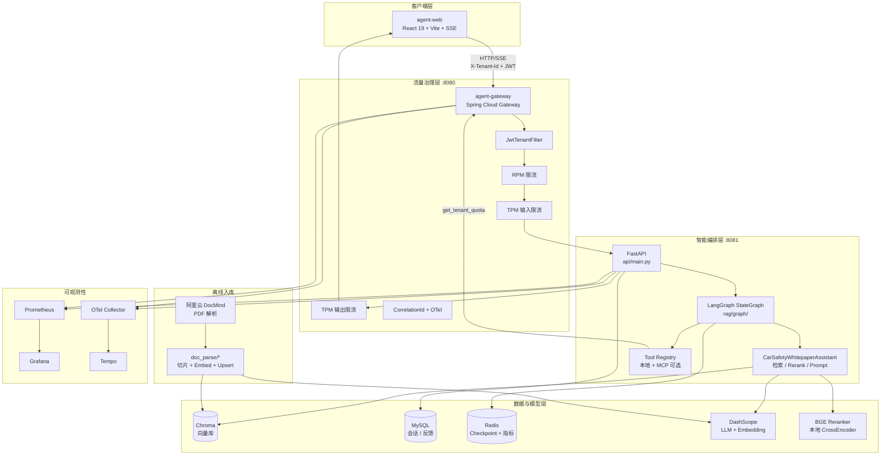
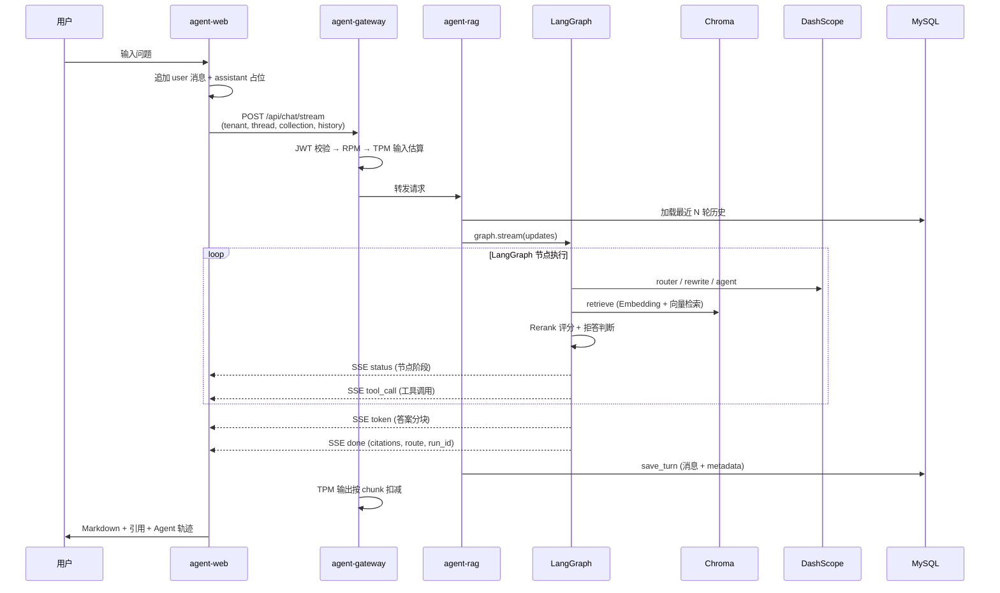
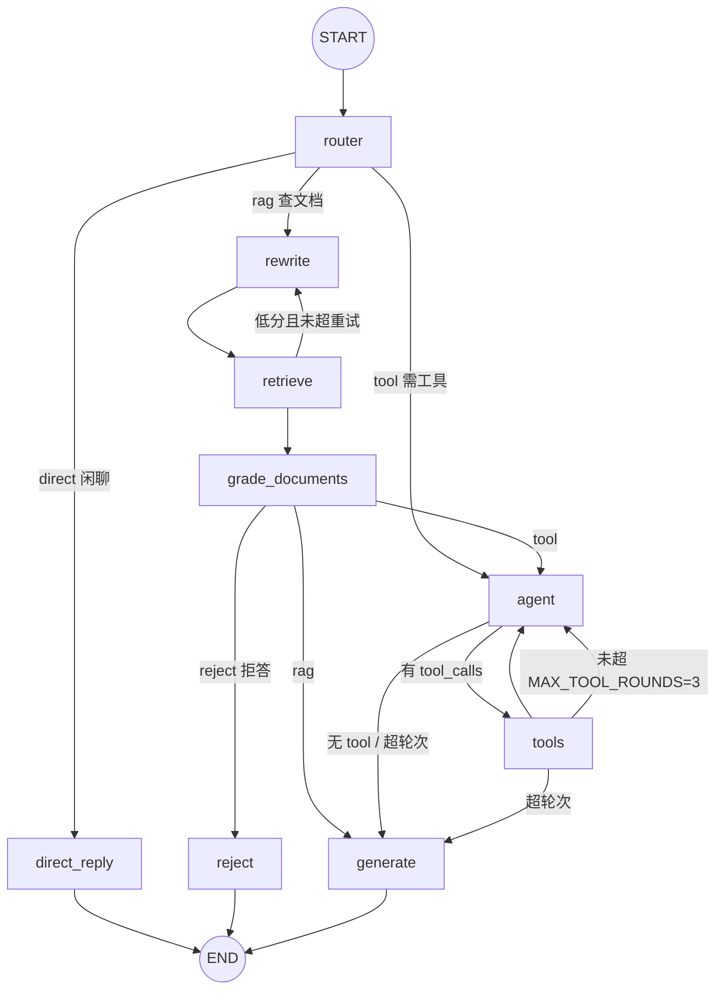
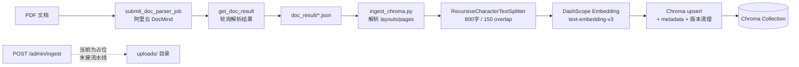
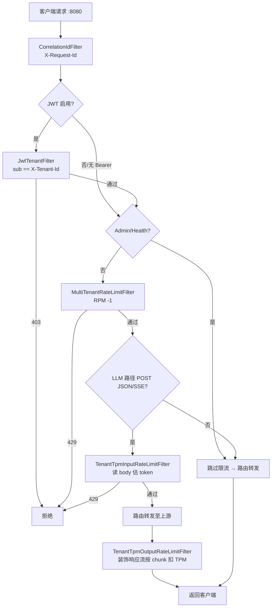
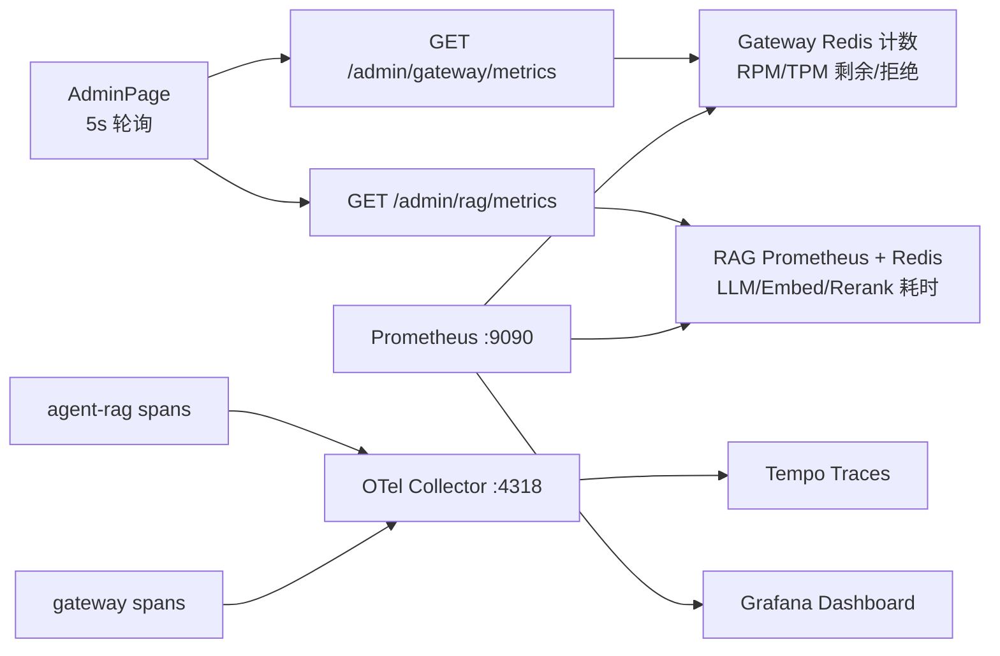

# Agent 全栈项目架构总结

> 涵盖 **agent-web**（前端）、**agent-gateway**（网关）、**agent-rag**（RAG Agent 后端）三仓库协同架构。  
> 用于项目理解与面试准备。

---

## 一、整体架构图




### 各层职责


| 仓库                | 端口   | 核心职责                             |
| ----------------- | ---- | -------------------------------- |
| **agent-web**     | 5173 | SSE 消费、会话 UI、Admin 看板            |
| **agent-gateway** | 8080 | 路由、JWT、多租户 RPM/TPM 限流、链路追踪       |
| **agent-rag**     | 8081 | LangGraph Agent 编排、RAG 检索、持久化、指标 |


### 系统组件与职责


| 组件               | 路径                                   | 职责                                                                                    |
| ---------------- | ------------------------------------ | ------------------------------------------------------------------------------------- |
| **API 入口**       | `api_server.py` → `api/main.py`      | FastAPI 应用，生命周期内初始化 OTel、Redis checkpoint、MySQL、Assistant 缓存                          |
| **聊天 API**       | `api/chat.py`                        | `POST /api/chat/stream`（**DashScope**）、`POST /api/chat/stop`（中断当前 thread 推理），多租户/多知识库 |
| **会话 API**       | `api/conversations.py`               | 列表、历史、删除（MySQL 持久化）                                                                   |
| **反馈 API**       | `api/feedback.py`                    | 点赞/点踩写入 MySQL + Prometheus 计数                                                         |
| **Admin API**    | `api/admin.py`                       | `GET /admin/metrics` 运行时指标                                                            |
| **入库 API**       | `api/ingest.py`                      | `POST /admin/ingest` 上传文件（**当前为占位实现**）                                                |
| **核心 RAG**       | `rag/assistant.py`                   | Chroma 检索、DashScope Embedding/LLM、本地 Rerank、Prompt 模板                                 |
| **LangGraph 编排** | `rag/graph/`*                        | StateGraph：路由 → 改写 → 检索 → 评分 → Agent/Tool 循环 → 生成                                     |
| **意图路由**         | `rag/router.py`                      | LLM 三分类：`direct` / `rag` / `tool`                                                     |
| **拒答逻辑**         | `rag/reject.py`                      | 基于 Rerank 分数阈值（`RETRIEVAL_MIN_SCORE=0.15`）拒答或澄清                                       |
| **Tool 注册**      | `rag/tools/registry.py`              | 本地 Chroma 工具 + Gateway 配额 + MCP 可选                                                    |
| **Checkpoint**   | `rag/checkpoint.py`                  | LangGraph 状态持久化（Redis RediSearch，失败回退 MemorySaver）                                    |
| **可观测性**         | `rag/telemetry.py`, `rag/metrics.py` | OpenTelemetry Span + Prometheus + Redis 计数                                            |
| **数据库**          | `db/`*                               | SQLAlchemy + MySQL：conversations、chat_messages、chat_feedback                          |
| **文档入库（离线）**     | `doc_parse/`*                        | 阿里云 DocMind 解析 → JSON → 切片 → Embedding → Chroma upsert                                |
| **MCP Server**   | `mcp_servers/whitepaper/`            | 可选，将检索工具以 MCP 协议暴露                                                                    |
| **可观测部署**        | `deploy/observability/`              | Docker Compose：Prometheus + Grafana + Tempo + OTel Collector                          |


### 知识库（多 Collection）

- `white_paper_iot` — 汽车安全白皮书（默认）
- `semiconductor` — 半导体行业文档

---

## 二、核心数据流程图

### 2.1 聊天主链路




### 2.2 LangGraph 状态图

实现于 `rag/graph/builder.py`：




**三条路由路径（`rag/router.py`）：**


| 路由       | 场景               | 路径                                    |
| -------- | ---------------- | ------------------------------------- |
| `direct` | 闲聊、与知识库无关        | router → direct_reply                 |
| `rag`    | 明确查白皮书/半导体文档     | rewrite → retrieve → grade → generate |
| `tool`   | 需主动选工具（统计、精确查页等） | agent ↔ tools 循环 → generate           |


**AgentState 主要字段（`rag/graph/state.py`）：**

`messages`, `user_query`, `rewritten_query`, `documents`, `context`, `route`, `tool_calls_log`, `citations`, `answer`, `reject_message`, `tool_rounds`, `retrieve_retries`

### 2.3 文档入库链路（离线）




**生产入库入口脚本：**

- `doc_parse/run_docmind_pipeline.py` — 单文档全流程
- `doc_parse/run_semiconductor_batch.py` — 批量半导体文档

### 2.4 Gateway 请求处理流程




**Gateway 路由配置：**


| 路由 ID                  | 路径                      | 上游                                             | 说明                    |
| ---------------------- | ----------------------- | ---------------------------------------------- | --------------------- |
| `agent-rag-api`        | `/api/`**               | [http://127.0.0.1:8081](http://127.0.0.1:8081) | 主业务 API               |
| `agent-rag-health`     | `/health`               | [http://127.0.0.1:8081](http://127.0.0.1:8081) | 健康检查，跳过 RPM           |
| `agent-rag-admin`      | `/admin/rag/`**         | [http://127.0.0.1:8081](http://127.0.0.1:8081) | Rewrite → `/admin/**` |
| `agent-rag-prometheus` | `/admin/rag/prometheus` | [http://127.0.0.1:8081](http://127.0.0.1:8081) | Rewrite → `/metrics`  |


Gateway 自身还提供 `GET /admin/gateway/metrics`（租户配额视图）。

### 2.5 Admin / 可观测链路




---

## 三、技术栈全景

### 3.1 按层次分类


| 层次                | 技术                                                           | 用途                          |
| ----------------- | ------------------------------------------------------------ | --------------------------- |
| **前端**            | React 19, TypeScript, Vite 8, Tailwind 4, react-router-dom 7 | 聊天 UI、Admin 看板              |
| **网关**            | Spring Boot 4, Spring Cloud Gateway, WebFlux, Java 21        | 路由、限流、JWT                   |
| **后端 API**        | FastAPI, Python 3.12/3.13                                    | REST + SSE 流式               |
| **Agent 编排**      | LangGraph, LangChain                                         | StateGraph + Tool Calling   |
| **向量库**           | Chroma (HTTP Client)                                         | 多 Collection 向量检索           |
| **关系库**           | MySQL + SQLAlchemy                                           | 会话、消息、反馈                    |
| **缓存/状态**         | Redis + RediSearch                                           | LangGraph Checkpoint、指标计数   |
| **LLM/Embedding** | 阿里云 DashScope (qwen3.7-plus, text-embedding-v3)              | 生成、改写、路由、Embedding          |
| **Rerank**        | BAAI/bge-reranker-base (sentence-transformers)               | 本地 CrossEncoder 重排          |
| **文档解析**          | 阿里云 DocMind DocParser                                        | PDF 结构化解析                   |
| **限流**            | Bucket4j + Lettuce Redis                                     | 分布式令牌桶 RPM/TPM              |
| **可观测**           | OpenTelemetry, Prometheus, Grafana, Tempo                    | Trace + Metrics + Dashboard |
| **可选扩展**          | MCP Server (whitepaper)                                      | 工具标准化接入                     |
| **可选追踪**          | LangSmith                                                    | LLM 调用 trace                |


### 3.2 外部依赖


| 依赖                | 用途                                | 配置                                      |
| ----------------- | --------------------------------- | --------------------------------------- |
| **Chroma**        | 向量存储（HTTP Client）                 | `CHROMA_HOST/PORT`，Collection 按知识库区分    |
| **DashScope（通义）** | LLM + Embedding                   | `DASHSCOPE_API_KEY`, OpenAI 兼容端点        |
| **MySQL**         | 对话/反馈持久化                          | `MYSQL_`*, 密码变量 `MySql_Password`        |
| **Redis**         | LangGraph checkpoint + metrics 计数 | `REDIS_`*, 与 agent-gateway 共用实例         |
| **本地 Rerank**     | BAAI/bge-reranker-base            | `RERANK_`*, 可选 GPU                      |
| **阿里云 DocMind**   | PDF 结构化解析                         | `alibabacloud_docmind_api`              |
| **MCP**           | 可选工具标准化接入                         | `MCP_ENABLED`, `MCP_WHITEPAPER_COMMAND` |
| **agent-gateway** | Tool `get_tenant_quota` 读 RPM/TPM | `GATEWAY_BASE_URL`                      |
| **LangSmith**     | 可选 trace                          | `LANGCHAIN_TRACING_V2`                  |


### 3.3 SSE 事件协议

详见 [sse-events.md](./sse-events.md)。


| 事件          | 含义                                 | 前端展示                         |
| ----------- | ---------------------------------- | ---------------------------- |
| `status`    | 节点阶段 (router/retrieve/generate...) | StatusIndicator + AgentTrace |
| `token`     | 增量文本                               | 流式 Markdown                  |
| `tool_call` | 工具 start/end + args/result         | ToolCallPanel                |
| `done`      | 完整回复 + citations + route + run_id  | CitationList + 反馈按钮          |
| `error`     | 错误                                 | 友好错误提示                       |


### 3.4 内置 Tools（5 个）

1. `search_whitepaper` — 向量检索 + Rerank
2. `get_chunk_by_source` — 按 source + page 精确查 chunk
3. `list_collection_stats` — 集合统计
4. `get_tenant_quota` — 读 Gateway 租户配额（跨服务调用）
5. `reject_or_clarify` — 检索质量不足时的业务规则

### 3.5 API 路由一览

**启动：** `python api_server.py`（默认 `127.0.0.1:8081`）


| 方法     | 路径                                    | 说明                            |
| ------ | ------------------------------------- | ----------------------------- |
| GET    | `/health`                             | 健康检查                          |
| GET    | `/metrics`                            | Prometheus                    |
| GET    | `/api/knowledge-bases`                | 知识库列表                         |
| POST   | `/api/chat/stream`                    | SSE 聊天（核心）                    |
| POST   | `/api/chat/stop`                      | 中断当前 thread 的推理（阻止后续节点/token） |
| GET    | `/api/chat/conversations`             | 会话列表                          |
| GET    | `/api/chat/history`                   | 会话历史                          |
| DELETE | `/api/chat/conversations/{thread_id}` | 删除会话                          |
| POST   | `/api/chat/feedback`                  | 反馈                            |
| GET    | `/admin/metrics`                      | Admin 指标                      |
| POST   | `/admin/ingest`                       | 上传（占位）                        |
| GET    | `/admin/ingest/{job_id}`              | 入库任务状态                        |


---

## 四、技术难点

### 难点 1：从固定 RAG 到 LangGraph Agent 的演进

**问题：** 原 `assistant.py` 是写死的 `rewrite → retrieve → generate`，无法分支、无法 Tool Calling。

**方案：**

- 用 **StateGraph** 显式建模状态与条件边
- **Router 节点** LLM 三分类（direct/rag/tool）
- 保留原有 SSE 契约，扩展 `tool_call` 事件

**面试话术：** 「我们没有一次性重写，而是按节点 1:1 迁移，先 Tool Calling，再 LangGraph 替换流水线，降低风险。」

详见 [agent.md](./agent.md) 中的演进方案。

---

### 难点 2：多路径编排与 TPM 成本控制

**问题：** 一次请求可能触发多次 LLM（router + rewrite + agent 多轮 + generate），与 Gateway TPM 限流需要对齐。

**方案：**

- `MAX_TOOL_ROUNDS=3`、`MAX_RETRIEVE_RETRIES=2` 硬上限
- Gateway 对 `/api/chat/` 做 **TPM 输入/输出** 双向限流
- Token 估算：输入解析 `message + history[]`，输出解析 SSE `data:` chunk

**面试话术：** 「Agent 多轮调用会放大 token 消耗，所以在图层面设轮次上限，在网关层做租户级 TPM 双向扣减。」

---

### 难点 3：检索质量门控（拒答机制）

**问题：** 向量检索可能返回不相关文档，直接生成会幻觉。

**方案：**

- 本地 **BGE Reranker** 对 top-k 重排
- `should_reject()` 基于 top-1 分数与 `RETRIEVAL_MIN_SCORE=0.15`
- 低分 → 澄清/拒答；空结果 → 直接拒答
- retrieve 失败可触发 rewrite 重试（条件循环）

**面试话术：** 「RAG 不是检索到就答，我们有 Rerank 分数阈值 + grade_documents 节点做质量门控。」

---

### 难点 4：SSE 流式与 LangGraph 的契合

**问题：** 仅用 `stream_mode="updates"` 时，只能等节点完成后才拿到完整 answer，无法 LLM token 级流式。

**方案：**

- `stream_mode=["updates", "messages"]` 双模式：`updates` 推送节点状态 → SSE `status` / `tool_call`
- `messages` 按 `metadata.langgraph_node` 白名单过滤，仅 `generate` / `direct_reply` 映射为 SSE `token`（rewrite / agent 等内部 LLM 不泄漏）
- `reject` 无 LLM 调用，节点 update 时一次性下发拒答文本
- legacy `stream_response` 保留作固定 RAG 流水线对照/回退

**面试话术：** 「Agent 轨迹用 updates 保证可见性；最终答案用 messages 模式做 generate/direct_reply 真 token 流，按 langgraph_node 过滤，前端 SSE 协议不变。」

---

### 难点 5：Gateway 分布式 TPM 限流

**问题：** 多实例网关 + 流式响应，如何准确扣减 TPM？

**方案：**

- **Bucket4j + Redis CAS** 分布式令牌桶
- **TPM 输入**：缓存 body → 解析 JSON 估 token → 扣配额 → Decorator 回放 body
- **TPM 输出**：装饰 `ServerHttpResponse.writeWith`，每个 chunk 解析 SSE delta 扣减
- 429 返回 OpenAI 风格 JSON，含 `request_id`

**限流维度：**


| 维度         | 适用范围                         | Redis Key 模式             | 默认配额（default_tenant） |
| ---------- | ---------------------------- | ------------------------ | -------------------- |
| **RPM**    | 除 `/admin/`**、`/health` 外全路径 | `limit:rpm:{tenant}`     | 60/分钟                |
| **TPM 输入** | LLM 路径 + POST + JSON/SSE     | `limit:tpm:in:{tenant}`  | 2000/分钟              |
| **TPM 输出** | 同上（响应侧）                      | `limit:tpm:out:{tenant}` | 2000/分钟              |


**面试话术：** 「RPM 是请求级，TPM 是 token 级；输入在转发前扣，输出在响应流装饰器里按 chunk 扣，保证流式场景下配额准确。」

---

### 难点 6：Redis Checkpoint 与跨进程会话

**问题：** LangGraph 需要 checkpoint 支持多轮对话恢复。

**方案：**

- `langgraph-checkpoint-redis` + RediSearch 索引
- `thread_id` 作为 configurable key
- Redis/RediSearch 不可用 → 降级 **MemorySaver**（重启丢失）

**面试话术：** 「Checkpoint 让 Agent 状态可恢复；我们做了优雅降级，Redis 挂了不阻断聊天，只是跨重启状态丢失。」

---

### 难点 7：文档入库链路复杂度

**问题：** DocMind 多种 JSON 格式、页码映射、layout 过滤、版本增量 upsert。

**方案：**

- 支持 legacy pages / docmind layouts / doc_parser markdown
- 过滤 footer/figure 等低价值 layout
- `doc_version` 增量 upsert + stale chunk 清理
- **HTTP `/admin/ingest` 尚未打通**（当前占位）

**面试话术：** 「生产入库走 CLI 脚本，HTTP API 是预留接口；难点在 DocMind 输出格式多样性和 Chroma metadata 一致性。」

---

### 难点 8：多租户 / 多知识库隔离

**方案：**

- `X-Tenant-Id` 贯穿 metrics、checkpoint、MySQL、Gateway 限流
- Assistant 按 `(tenant, collection)` 缓存
- 不同 collection 独立 Chroma collection + domain prompt
- JWT 可选绑定：`sub` 必须与 `X-Tenant-Id` 一致

---

### 难点 9：可观测性三层架构


| 层           | 实现                           | 用途                                                     |
| ----------- | ---------------------------- | ------------------------------------------------------ |
| **Trace**   | OTel → Tempo                 | 节点级 span（`rag.graph.{node}`, `chroma.query`, `rerank`） |
| **Metrics** | Prometheus histogram/counter | p95 延迟、拒答率、检索分数                                        |
| **业务计数**    | Redis incr                   | Admin 跨重启累计（与 Prometheus 双写）                           |
| **Logs**    | stdlib logging + JSON 可选     | 应用日志；`LOG_FORMAT=json` 便于 Loki/ELK 采集                 |


**应用日志（`rag/logging_config.py`）：**

- `LOG_LEVEL`：默认 `INFO`；`RAG_VERBOSE_RETRIEVAL=true` 时 `rag.assistant` 降为 `DEBUG`
- `LOG_FORMAT=text|json`：开发用可读文本，生产用 `python-json-logger` 单行 JSON
- `ContextFilter` 自动注入 `request_id` / `tenant_id` / `thread_id` / `trace_id`（与 OTel trace 关联）
- 全仓库统一 `logger`，不再使用 `print()`；CLI 脚本入口调用 `configure_logging()`

**Span 示例：** `rag.graph.run`, `rag.graph.{node}`, `chroma.query`, `rerank`, `dashscope.embedding`, `rag.llm.invoke`

**Prometheus 指标示例：** `agent_request_duration_seconds`, `rag_node_duration_seconds`, `rag_chroma_query_duration_seconds`, `rag_retrieval_score`, `rag_reject_total`

**面试话术：** 「Trace 看单次请求路径，Metrics 看 SLA，Redis 计数给 Admin 看租户级累计。」

---

### 难点 10：MySQL 最佳努力持久化

**方案：**

- `save_turn_best_effort` 失败只打日志，不阻断聊天
- 历史加载失败回退客户端 `history`
- 启动时 MySQL 初始化失败不阻断服务（conversation persistence disabled）

---

## 五、面试讲述结构建议

### 30 秒电梯演讲

> 这是一个三层的 RAG Agent 系统：React 前端通过 Spring Cloud Gateway 做 JWT 和多租户 RPM/TPM 限流，后端 Python FastAPI 用 LangGraph 编排 Router/RAG/Tool 三条路径，Chroma 向量检索 + 本地 BGE Rerank，DashScope 做 LLM 和 Embedding。支持 SSE 流式、会话持久化、全链路 OTel 可观测。

### 2 分钟深度版（按 STAR）

1. **背景**：汽车安全/半导体白皮书问答，从 Demo 固定 RAG 演进为 Agent
2. **架构**：三仓库分工，Gateway 治理、RAG 智能、Web 展示
3. **核心难点**：LangGraph 多路径编排、检索质量门控、Gateway TPM 流式限流
4. **成果**：多知识库、多租户、Admin 看板、Prometheus 告警

### 可能被追问的问题


| 问题                                  | 回答要点                                                        |
| ----------------------------------- | ----------------------------------------------------------- |
| 为什么用 LangGraph 而不是 LangChain Agent？ | 显式状态图、条件边、checkpoint、与 LangSmith 节点对齐                       |
| Rerank 为什么本地而不是 API？                | 延迟可控、无额外 TPM、BGE 效果够用                                       |
| 如何保证回答不幻觉？                          | Rerank 阈值拒答 + Prompt 要求引用 + citations 返回                    |
| Gateway 和 RAG 如何配合限流？               | Gateway 租户级；RAG 内 Tool 可调 `get_tenant_quota` 自查             |
| Checkpoint 存什么？                     | messages、documents、route、tool_calls_log 等 AgentState        |
| 入库和在线检索如何一致？                        | 同一 Embedding 模型、同一 Chroma collection、metadata 含 source/page |


---

## 六、项目演进阶段


| 阶段      | 内容                         | 状态          |
| ------- | -------------------------- | ----------- |
| Phase 1 | Tool Calling 小集 + SSE 扩展   | ✅ 已完成       |
| Phase 2 | LangGraph 替换固定流水线 + Router | ✅ 已完成       |
| Phase 3 | MySQL 会话持久化 + 反馈           | ✅ 已完成       |
| Phase 4 | MCP 可选接入                   | ⚠️ 可选，已实现   |
| Phase 5 | HTTP ingest 打通 DocMind 流水线 | ❌ 占位，待完善    |
| Phase 6 | grade_documents / 幻觉检测     | ⚠️ 部分（拒答已有） |


---

## 七、本地启动拓扑

```
agent-web     →  http://localhost:5173  (Vite 代理到 8080)
agent-gateway →  http://127.0.0.1:8080
agent-rag     →  http://127.0.0.1:8081
Chroma        →  CHROMA_HOST:CHROMA_PORT
MySQL / Redis →  见 .env.example
Observability →  deploy/observability/docker-compose.yaml
```

### 三仓库协同关系

```
agent-web (React SSE 客户端)
    ↓
agent-gateway (JWT、多租户限流、路由)
    ↓
agent-rag (FastAPI + LangGraph + RAG)
    ↔ Chroma / DashScope / MySQL / Redis
    ↔ DocMind（离线 ingest）
    ↔ MCP Server（可选）
```

---

## 相关文档

- [agent.md](./agent.md) — Demo → Agent 平台演进方案
- [sse-events.md](./sse-events.md) — SSE 事件协议详细说明
- [deploy/observability/README.md](../deploy/observability/README.md) — 可观测性栈部署

